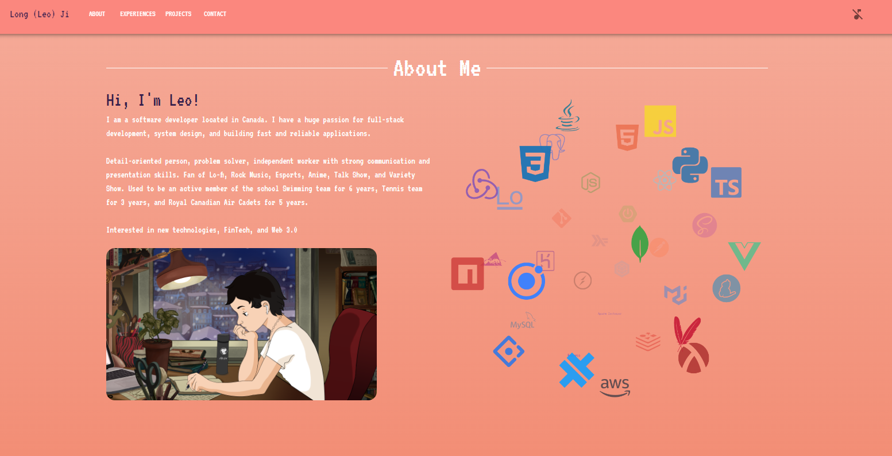

# Personal Website build using React and Material-Ui

## Setup
```
# install dependencies
npm i

# run the server
npm start
```


## Deployed Web
#### click [here](https://www.longleoji.com/)


## Other third-party libraries ##
1. react-icon-cloud(https://www.npmjs.com/package/react-icon-cloud)
1. react-visibility-sensor(https://www.npmjs.com/package/react-visibility-sensor)


